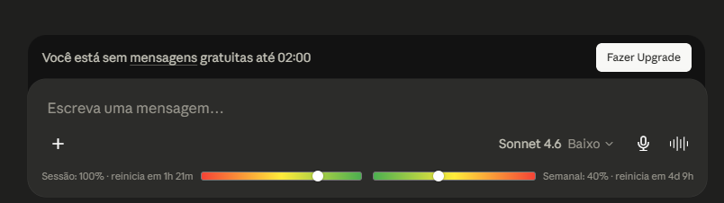

# 🎨🇧🇷 Claude Counter — Tradução PT-BR

> ⚠️ **Aviso**
>
> Esta versão recebeu tradução para Português do Brasil (PT-BR) e melhorias visuais em CSS para facilitar a leitura e a experiência do usuário.
>
> ✍️ Tradução e edição visual por **[@havylliard](https://github.com/havylliard)**.
>
> 🔒 O código-fonte, funcionalidades, lógica e estrutura original permanecem intactos e compatíveis com o repositório oficial.
>
> 🇧🇷 Foram alterados apenas os textos da interface e alguns elementos visuais (CSS).
>
> ❤️ Todo o crédito pelo desenvolvimento do projeto pertence aos autores originais.

---

# 📊 Claude Counter

Uma extensão minimalista para navegador que exibe a contagem de tokens, temporizador de cache e barras de utilização diretamente no **claude.ai**.

## ✨ Funcionalidades

- 🔢 **Contador de Tokens** — Exibe uma estimativa da quantidade de tokens da conversa atual, incluindo uma mini barra de progresso baseada no limite de contexto de 200 mil tokens.
- ⏳ **Temporizador de Cache** — Mostra quanto tempo a conversa permanecerá em cache, permitindo continuar a conversa com menor custo.
- 📈 **Barras de Utilização** — Exibe o uso da sessão (5 horas) e semanal (7 dias) utilizando a API nativa do Claude, com barras de progresso e contagem regressiva para redefinição dos limites.

---

## 🚀 Instalação

### 🌐 Chrome / Edge / Chromium

1. Baixe o arquivo [`claude-counter-0.4.2.zip`](../../releases/download/v0.4.2/claude-counter-0.4.2.zip)
2. Acesse `chrome://extensions`
3. Ative o **Modo Desenvolvedor**
4. Arraste o arquivo ZIP para a página

### 🦊 Firefox

1. Baixe o arquivo [`claude-counter-0.4.2.xpi`](../../releases/download/v0.4.2/claude-counter-0.4.2.xpi)
2. Arraste o arquivo para qualquer janela do Firefox
3. Clique em **Adicionar**

### 📜 Userscript

1. Instale o userscript disponível em [`claude-counter.user.js`](./userscript/claude-counter.user.js)

---

## ⚙️ Como Funciona

- 🔍 Intercepta as respostas da API do Claude para obter informações da conversa e estatísticas de uso.
- 🧮 Utiliza o tokenizador incorporado (`o200k_base`) para realizar a contagem aproximada de tokens.
- 📡 Utiliza o endpoint `/usage` do Claude juntamente com os dados SSE `message_limit` em tempo real.
- 📊 Os dados SSE fornecem valores exatos de utilização, tornando as barras de progresso mais precisas do que os percentuais arredondados exibidos na página oficial de uso.
- 🖥️ Monitora alterações no DOM para inserir automaticamente os elementos da interface durante a navegação.

---

## 🔒 Privacidade

- ✅ Todos os dados permanecem localmente no navegador.
- ✅ Nenhum servidor externo é utilizado.
- ✅ Nenhum sistema de rastreamento é empregado.
- 🍪 Lê apenas o cookie `lastActiveOrg` para consultar o endpoint `/usage` do Claude.
- 🌐 Realiza requisições exclusivamente para `claude.ai`.

---

## 🙏 Créditos

- 🧮 Contagem de tokens via [gpt-tokenizer](https://github.com/niieani/gpt-tokenizer) (MIT)
- 💡 Inspirado em [Claude Usage Tracker](https://github.com/lugia19/Claude-Usage-Extension) por **lugia19**

---

## 📄 Licença

MIT

---

## ❤️ Nota do Tradutor

Esta versão foi traduzida e adaptada visualmente por **@havylliard**.

🎨 Algumas melhorias visuais foram adicionadas através de CSS, incluindo gradientes e ajustes de interface para melhor legibilidade.

🔒 Nenhuma funcionalidade original foi modificada. Toda a lógica, estrutura e comportamento da extensão permanecem iguais aos do repositório oficial.

⭐ Caso goste do projeto, considere apoiar também os desenvolvedores originais.
